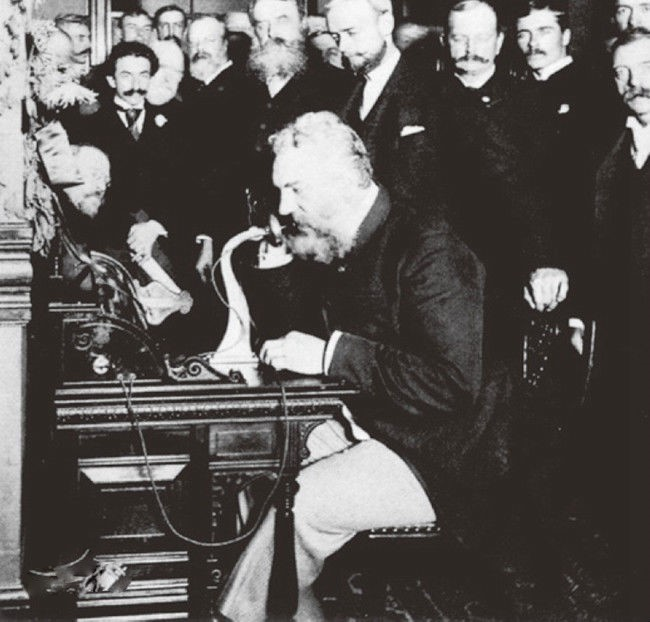
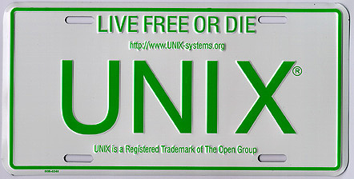
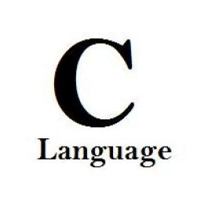
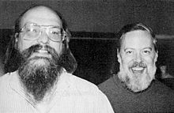
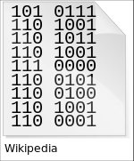
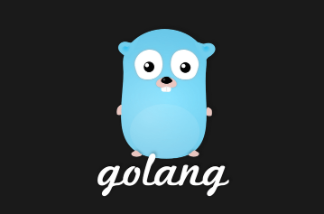

# 前言

俗话说`一叶障目，不见泰山`，其释义为：

> 一片树叶挡住了眼睛，连面前高大的泰山都看不见；比喻为局部现象所迷惑，看不到全局的整体，也比喻目光短浅。

所以就像我们学习一样，如果不了解其历史，怎能学好呢？有了更开阔的视野，你的学习才会得心应手。

接下来我们需要吸取一个非常`long（长类型）`的故事。

## AT&T（美国电话电报公司）

[AT&T](https://www.att.com/)是一家美国电信公司，美国第二大移动运营商，创建于`1877`年，曾长期垄断美国长途和本地电话市场。

`C`语言和`Unix`等诸多知名软件都是起源于`贝尔实验室`，但是贝尔实验室的所属所属公司是`AT&T`。

## 贝尔和他的贝尔系统

我们的主角叫`亚历山大·格拉汉姆·贝尔（Alexander Graham Bell，1847-1922）`，他是美籍加拿大著名发明家和企业家，他获得了世界上第一台可用电话机的专利权，是`电话之父`。

它以电话专利权起家创建了`贝尔电话公司`，这家公司和之后的大量衍生公司最终被称为`贝尔系统`。

### 贝尔的黑历史

`2002年6月15日`，美国国会通过一项决议，判定意大利人`安东尼奥·梅乌奇（Antonio Meucci）`为电话的发明者，换言之他才是电话之父，那么历史到底是怎样的呢？

根据可以网上可以查到的资料显示：

意大利人`梅乌奇`在`1849年`的一天在他研究电生理学的过程中发现了电话的原理并开始研究他称之为会说话的电报机的装置，此时，`亚历山大·贝尔`才两岁。

在移居美国之后，因为不会英语的关系他始终融入不进主流社会，得不到应有的认可，甚至他连申请专利的钱都不够，更加让人心寒的是，`1876`年和`梅乌奇`共用一个实验室的`贝尔`向美国专利局提出申请电话的专利权。

当然，`梅乌奇`愤而提起上诉，当时最高法院已经同意以欺诈罪指控`贝尔`，但就在胜利曙光要显现时，年近80穷困潦倒、病魔缠身的`梅乌奇`却于`1889`年带着遗憾`离开了人世`。

历史就是如此具有魔力，成王败寇，从来如此。

贝尔获得了电话的专利权，成为`电话之父`，名声大噪，创建了`贝尔电话公司（AT&T前身）`，自此，历史的车轮一直走到了今天。

> 当然，我们不能因为一点而完全否认一个人，贝尔还是为社会、科技的发展作出了卓越的贡献。

### 贝尔系统

`贝尔`创建的`贝尔系统`，也可以用`ATt&T`代称，在其100多年的历史中，经历了多次的拆分和重组（由于自身发展或是政府反垄断）。

`贝尔系统`包括母公司`AT&T`和数量庞大的子公司和研究所，曾长期垄断了80%-90%的美国市话和长途业务，而到今天，现在的`AT&T`已经是被拆分了几次之后的结果了。

贝尔系统的历史如下：

1. `1877`年，贝尔成立了一家叫做`美国贝尔电话公司`的公司；
2. `1895`年，贝尔又成立了一个公司来负责其正在开发的美国全国范围的长途业务，这就是`AT&A（美国电报电话公司）`;
3. `1899`年，`AT&T`整合了`贝尔电话公司`的业务，成为了贝尔系统（贝尔的一系列公司）的母公司；
4. `1984`年，美国司法部根据《反托拉斯法》拆分了`AT&T`，将其分为8个公司，1个公司继承了母公司名字AT&T（专营长途话务）、7个本地电话公司（贝尔七兄弟）；
5. `1995`年，`AT&T`再次被分离为3个公司，除了1个`AT&T`外，分出了2个从事设备开发制造的`朗讯科技`和`NCR`，至此`AT&T` 只保留了通信服务业务；
6. `2005`年，原贝尔七兄弟之一的`西南贝尔`，以160亿收购了`AT&T`，合并后的企业保留了`AT&T`名字；

> 其实和我们关系最大的是`AT&T`的一个部门：`贝尔实验室`

## Bell Labs（贝尔实验室）

`贝尔实验室`如雷贯耳，自`1925`年以来，实验室共获得了两万五千多项专利，8项诺贝尔奖。

贝尔实验室的历史如下：

1. `1925`年，`AT&T`收购了西方电子公司的研究部门，成立了一个叫做`贝尔电话实验室公司`的独立实体，后来改称为：`贝尔实验室`；
2. `1995`年，从`AT&T`分离出了独立公司`朗讯科技（Lucent Technologies）`，贝尔实验室一并归入`朗讯科技`麾下；
3. `2006`年，法国`阿尔卡特（Alcatel）公司`收购了朗讯，在合并后的新公司中，朗讯只占40%，其合并后的规模仅次于美国思科，新公司称为：`阿尔卡特-朗讯（Alcatel - Lucent）`，`贝尔实验室`目前属于`阿朗`；
4. `2008`年，由于`阿郎`长期亏损，不得不出售了已经有46年历史的`贝尔实验室大楼`，值得欣慰的是，购得大楼的地产开发商并没有完全抹掉大楼的计划；
5. `2015`年，`诺基亚`宣布将以`156亿欧元`收购`阿郎`，预计2016年上半年完成，如果`贝尔实验室`部门还存在，应该要归入`诺基亚`了；

## 贝尔实验室与软件行业

由上可知，`贝尔实验室`其实是专注于`通讯领域`的，但其对计算机软件领域的影响却也是无与伦比的。

### B与UNIX

`20世纪60年代`，`贝尔实验室`的研究员`Ken Thompson（肯·汤普森）`发明了`B`语言，并使用B编了个游戏（Space Travel），他想玩自己这个游戏，所以他背着老板找到了台空闲的机器（PDP-7），但是这台机器没有操作系统，于是`Thompson`着手为`PDP-7`开发操作系统，后来这个OS被命名为`UNIX`。

> Thompson（肯·汤普森）发明了UNIX

### C

`1971`年，`Ken Thompson`的同事`D.M.Ritchie（DM里奇）`，也很想玩`Space Travel`，所以加入了`Ken Thompson`，合作开发`UNIX`，他的主要工作是改进`Thompson`的`B`语言。

最终，在`1972`年这个新语言被称为`C`，取`BCPL`的第二个字母，也是`B`的下一个字母。

> D.M.Ritchie（DM里奇）发明了C语言

### C与UNIX

`1973`年，`C`主体完成。`Ken Thompson`和`D.M.Ritchie`迫不及待的开始用`C`语言完全重写了`UNIX`，此时编程的乐趣已经使他们完全忘记了那个`Space Travel`，一门心思的投入到了`UNIX`和`C`语言的开发中，自此，`C`语言和`UNIX`相辅相成的发展至今。

> Ken Thompson（left）和D.M.Ritchie（right）

`贝尔实验室`太过伟大，甚至关于编程语言如此重要的发展历史部分，在实验室整体历史中都显得那么`微不足道`

## 编程语言

`编程语言（programming language）`是用来定义计算机程序的形式语言。

它是一种被标准化的交流技巧，用来向计算机发出指令，一种计算机语言让程序员能够准确地定义计算机所需要使用的数据，并精确地定义在不同情况下所应当采取的行动。

> [维基百科](https://zh.wikipedia.org/wiki/%E7%BC%96%E7%A8%8B%E8%AF%AD%E8%A8%80)

随着时代的发展，每年都有各种各样的编程语言出现，但归根结底，主要还是分为一下三大类。

### 机器语言

`机器语言（machine language）`是用二进制代码表示的计算机能直接识别和执行的一种机器指令的集合。

要用机器语言编写程序，编程人员需首先熟记所用计算机的全部指令代码和代码的涵义，编程序时，程序员要自己处理每条指令和每一数据的存储分配和输入输出，还需记住编程过程中每步所使用的工作单元处在何种状态。

这是一件十分繁琐的工作，编写程序花费的时间往往是实际运行时间的几十倍或几百倍。

而且，这样编写出的程序完全是0与1的指令代码，可读性差且容易出错。在现今，除了计算机生产厂家的专业人员外，绝大多数程序员已经不再学习机器语言。

> [维基百科](https://zh.wikipedia.org/wiki/%E6%9C%BA%E5%99%A8%E8%AF%AD%E8%A8%80)

**优点：**

1. 直接执行、速度快、占用资源少；

**缺点：**

1. 可读性差、编程痛苦；

### 汇编语言

`汇编语言（assembly language）`使用助记符号来表示计算机指令，亦称为符号语言。

在汇编语言中，每一条用符号来表示的汇编指令都与一条计算机机器指令对应。汇编语言的出现大大降低了记忆难度，不仅便于检查和修改程序错误，而且指令、数据的存放位置可以由计算机自动分配。

**优点：**

1. 保持了机器语言的优点；

**缺点：**

1. 面向机器编程，可移植性差；
2. 开发效率低、可维护性差；

### 高级语言

`高级语言（High-level programming language）`是高度封装了的编程语言，与低级语言相对。

它是以人类的日常语言为基础的一种编程语言，使用一般人易于接受的文字来表示，使程序编写员编写更容易，亦有较高的可读性，以方便对电脑认知较浅的人亦可以大概明白其内容

> [维基百科]((https://zh.wikipedia.org/wiki/%E9%AB%98%E7%BA%A7%E8%AF%AD%E8%A8%80))

**优点：**

1. 易学、易掌握、可读性好、可维护性强；
2. 可移植性高、服用率高；
3. 将底层和复杂的实物交给编译器，精力集中在创造性劳动，提高程序质量、缩短开发周期；

高级语言又分为两大类，解释性语言和编译性语言，

- 解释型语言

一行一行的读取代码并执行，典型代表`Python`

- 编译型语言

编译成字节码文件之后在执行，典型代表`Go`

### 一个笑话

- Java

"咚咚咚"

"谁？"

过了很久……

"Java"

- PHP

女神："你能让这个论坛的人都吵起来，我今晚就跟你走。"

程序猿："PHP语言是最好的语言！"

论坛炸锅了，各种吵架。 

女神："服了你了，我们走吧，你想干啥都行。"

程序猿："今天不行，我一定要说服他们，PHP语言是最好的语言。"

## 结语

虽然时代在变迁，编程语言也在升级，但是`C`这种千古不变的语言是值得我们去学习的，市面上绝大多数的大学也都是采用`C`语言来进行入门，而且很多的`数据结构和算法`课程中，也大多都是`C`，所以学好`C`语言对我们来说只有好处没有坏处。

> 当然，如果你只想做一个普通的程序员，请止步。

## 参考文献

1. [C语言、编程语言发展史](http://blog.csdn.net/u010297957/article/details/51289544)
2. [编程语言](https://zh.wikipedia.org/wiki/%E7%BC%96%E7%A8%8B%E8%AF%AD%E8%A8%80)
3. [机器语言](https://zh.wikipedia.org/wiki/%E6%9C%BA%E5%99%A8%E8%AF%AD%E8%A8%80)
4. [高级语言](https://zh.wikipedia.org/wiki/%E9%AB%98%E7%BA%A7%E8%AF%AD%E8%A8%80)
5. [编译型语言、解释型语言、脚本语言的区别](http://blog.csdn.net/u011026329/article/details/51119402)