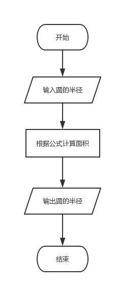

# 流程控制

流程控制的几大类：

1. 顺序结构
2. 选择结构
3. 循环结构

## 顺序程序设计

顺序结构是一种最为简单的结构，如以下示例：

输入圆的半径，计算并输出圆的面积

流程： `输入半径` --> `计算面积` --> `输出`

传统的流程图表示方法



c代码为：

```c
#include <stdio.h>
#define PI 3.14
int main(void)
{
    float s = 0;  // 圆的面积
    int r = 0;  // 半径
    printf("请输入圆的半径:");
    scanf("%d", &r);
    s = PI * r * r;
    printf("圆的面积为：%lf", s);
    return 0;
}
```

## 选择结构程序设计


### if else语句

```c
#include <stdio.h>

int main(void)
{
    int i = 0;
    printf("请输入一个整数: ");
    scanf("%d", &i);
    if(i < 10) {
        printf("I小于10");
    } else if(i < 20) {
        printf("I小于20");
    } else {
        printf("I大于20");
    }
    return 0;
}
```

```c
#include <stdio.h>

int main(void)
{
    int i = 0;
    printf("请输入一个整数: ");
    scanf("%d", &i);
    if(i < 10)
        ; // 空语句
    else if(i < 15);  // 空语句
    else if(i < 20)
        printf("小于20");
    else if(i < 30)
        {
            if (i==25)
                printf("等于25");
            else
                printf("小于30");
        }
    else
        printf("大于30");
    return 0;
}
```

### switch语句

```c
#include <stdio.h>

int main(void)
{
    // 根据用户输入的月份来输出月份对应的天数
    int month;
    printf("请输入月份，我来判断天数");
    scanf("%d",&month);
    switch(month)
    {
        case 1:
            printf("一月有31天");
            break;
        case 2:
            printf("二月有28/天");
            break;
        case 3:
            printf("三月有31/天");
            break; // 如果没有break语句，后面的case都为真；
        case 4:
            printf("四月有30/天");
            break;
        default:
            printf("当前程序暂时只能判断1-4月的情况!\n");
			break;
    }
    return 0;
}
```

**注意点**

1. `case`后面各个常量或变量表达式的值必须各不相同，类型一般为整型；
2. `case`后面要加`break`，否则程序会继续往下执行；
3. `default`分支一般用于错误处理，不要作为其中一个处理分之；

## 循环结构程序设计

### while


- 基本语法

```c
whilt(循环条件){
  循环操作语句
}
```

- 使用循环计算1-100的累加和

```c
# include <stdio.h>

int main(void)
{
    int i = 0;
    int sum = 0;
    while(i<101)
    {
        sum+=i;
        i++;
    }
    printf("结果是: %d",sum);
    return 0;
}
```

- 循环输出数组中的值

```c
#include <stdio.h>

int main(void)
{
    int a[10] = {1,2,3,4,5,6,7,8,9,10};
    int i = 0;
    while(i<10){
        printf("%d\n",a[i]);
        i++;
    }
    return 0;
}
```

### do...while

- 基本语法

```c
do {
  循环操作
}while(循环条件);
```

- 特点：先执行，再判断

1. 先执行一遍循环操作；
2. 符合条件，循环继续执行；
3. 否则循环推出；


- 使用do-while结构打印菜单

只能选择1-3之间的数字

```c
# include <stdio.h>

void main()
{
    int choice;
    // 打印游戏菜单
    printf("性格测试：\n");
    printf("如果你是一位君王，对于身边的伴侣您希望？\n");
    printf("1. 只要有一位真爱的妻子\n");
    printf("2. 可以两位以上的爱人\n");
    printf("3. 拥有三千佳丽\n");
    do{ // 如果输入错入，将一直循环输入
        printf("请选择：");
        scanf("%d",&choice);
        if(!(choice>=1 && choice<=3)){
            printf("只能输入1-3之间的数字，请重新输入！\n");
        }
    }while(!(choice>=1 && choice<=3)); //执行循环
    // 如果执行到这里，证明用户的输入是正确的，在1-3之间
    switch(choice)
    {
    case 1:
        printf("你选择了生命中的唯一，然而老旧军早已看穿了一切\n");
        break;
    case 2:
        printf("你个花心大萝卜\n");
        break;
    case 3:
        printf("呵呵呵呵，10元/包，江浙沪包邮\n");
        break;
    }
}
```

- 将一个数字进行反转

```c
# include <stdio.h>

void main()
{
    int num = 1234;
    printf("个位：%d\n",num % 10);
    printf("十位：%d\n",num / 10 %10);
    printf("百位：%d\n",num / 100 %10);
    printf("千位：%d\n",num / 1000 %10);
    // 规律：除10再模10
    int temp; // 临时变量
    while(num>0){
        printf("%d\n",num%10);
        num /= 10;  // 取出个位数字后，立即去掉个位数字
    }
}
```

- 使用不同的循环结构实现数字反转

方式1

```c
#include <stdio.h>

void main() {
    int value, right_num;
    do {
        printf("\n请输入一个数：");
        scanf("%d", &value);
        if (value <= 0) {
            printf("必须是正数！");
        }
    } while (value <= 0);
    printf("\n反转后的数为：");
    do {
        right_num = value % 10;
        printf("%d", right_num);
        value = value / 10;
    } while (value != 0);
    printf("\n");

}
```

方式2

```c
#include <stdio.h>

void main() {
    int value, right_num;
    value = 0;
    while (value <= 0) {
        printf("\n请输入一个数：");
        scanf("%d", &value);
        if (value <= 0) {
            printf("该数字必须是正数");
        }
        printf("\n反转后的数为：");
    }
    while (value != 0) {
        right_num = value % 10;
        printf("%d", right_num);
        value = value / 10;
    }
    printf("\n");

}
```

### for

- 语法

```c
for(表达式1;表达式2;表达式3){
  语句;
}
```

1. 表达式1：通常是为循环变量赋初始值，可省略，例如：i=0
2. 表达式2：循环条件，是否继续执行循环，可省略，例如：i>10
3. 表达式3：更新循环变量的值，可省略，例如：i++
4. 分号：用来分割三个表达式，不可省略，`for(;;)`是死循环

```c
#include <stdio.h>

void main() {
    const int N = 20;  // 定义一个常量，该常量只能读取不能被修改，且名称必须为大写
    int i;
    for (i = 0; i < N; i++) {  // 输出之后再执行i++
        printf("%d\t", i);
    }
}
```

- 循环输入6个月的工资数，计算半年内的平均工资

```c
#include <stdio.h>

void main() {
    const int MONTH_COUNT = 6;  // 月数
    int i;
    double salary;  // 工资
    double salary_total = 0;  // 6个月的总工资
    double salary_avg;  // 6个月的平均工资
    for (i = 1; i <= MONTH_COUNT; i++) {
        printf("请输入你第%d个月的工资：", i);
        scanf("%lf", &salary);  // 接收当前月的工资
        salary_total += salary; // 工资累加
    }
    salary_avg = salary_total / MONTH_COUNT;
    printf("半年内的平均工资是: %.2lf", salary_avg);
}
```

- 打印简易加法表

```c
#include <stdio.h>

void main() {
    int num;
    printf("请输入一个数字： ");
    scanf("%d", &num);
    for (int i = 0; i < num; ++i) {
        printf("%d + %d = %d", i, (num - i), num);
        if (!(i % 2)) {
            printf("\t");
        } else {
            printf("\n");
        }
    }
}
```

### break和continue


- break语句的作用

跳出循环，只针对switch和循环(while,for)结构，执行循环之后的语句;

- 循环输入玩家的年龄，如果年龄为负则停止输入，提示输入错误。

一旦输入的值为负，使用break跳出循环

```c
#include <stdio.h>

void main() {
    int age;
    for (;;) {
        printf("请输入你的年龄：");
        scanf("%d", &age);
        if (age < 0) {
            printf("输出错误！");
            break;
        }
    }
}
```

- 猜商品价格，5次内猜对有奖励

```c
#include <stdio.h>
#include <time.h>
#include <stdlib.h>

void main() {
    int price;  // 要用户猜的商品价格
    srand((unsigned) time(NULL));  // unsigned无符号
    price = rand() % 10000;  // 获取四个整型
    printf("%d\n", price);
    int guessPrice;  // 用户猜测的商品价格
    int count = 0;  // 用户记录猜的次数
    for (;;) {
        ++count;
        printf("请输入你猜测的价格：");
        scanf("%d", &guessPrice);
        if (guessPrice > price) {
            printf("猜大了！\n");
        } else if (guessPrice < price) {
            printf("猜小了！\n");
        } else {
            printf("猜测成功！\n");
            if (count <= 5) {
                printf("猜测次数小于5次，有奖励！");
            }
            break;
        }
    }
    printf("你一共猜了%d\n", count);
}
```

- 循环录入用户性别，只能使用字符m/M(男)或f/F(女)，一单输入错误，结束录入，要求统计录入正确的次数

```c
#include <stdio.h>

void main() {
    int count = 0;  // 计算录入正确的次数
    char sex; // 定义性别字符
    while (1) {
        printf("请输入性别字符： ");
        scanf("%c", &sex);
        fflush(stdin); // 记得清空缓冲区，避免错误
        if (sex != 'm' && sex != 'M' && sex != 'f' && sex != 'F') {
            break;
        }
        count++;
    }
    printf("一共录入次数为：%d", count);
}
```

- continue语句

跳过本次循环，继续下一次循环

> 如果for循环遇到continue语句，下一步回跳到更新循环变量，然后在进入下一次循环

- 循环输入5个玩家的年龄，统计年龄为负数的录入次数

如果录入正确则跳过，输入错误则计数器加1

```c
#include <stdio.h>

void main() {
    int age = 0;  // 计算录入正确的次数
    int count = 0; // 计数器
    for (int i = 0; i < 5; ++i) {
        printf("请输入玩家年龄： ");
        scanf("%d", &age);
        if (age >= 0) { // 正确
            continue;
        }
        count++;
    }
    printf("错误的年龄次数为：%d次\n", count);
}
```

- 求1-100之间的偶数和

```c
#include <stdio.h>

void main() {
    int num = 0; // 总和
    for (int i = 0; i <= 100; i += 2) {
        num += i;
    }
    printf("总和是： %d", num);
}
```

- 嵌套循环之打印星号图形

用`*`输出一个葵形图形

```c
#include <stdio.h>

void main() {
    for (int i = 0; i < 4; i++) {  // 外层循环控制行数和换行
        for (int k = 0; k <= 2 - i; ++k) {
            printf(" ");
        }
        for (int j = 0; j <= i * 2; j++) {  // 内层循环控制列数和列符号
            // 挖空的原理：判断什么时候打印星号，什么时候打印空格
            printf("*");  // 列符号
        }
        printf("\n");  // 换行
    }
}
```